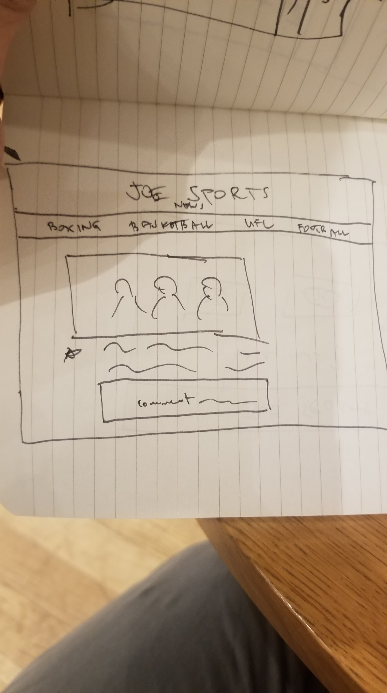

# project2

JOE SPORTS

My app is a sports news app where the user selects which latest news he wants to view (e.g. boxing, basketball, football). At the top is gonna be a navigation bar towards other sports and at the bottom of the news is gonna be a comment section where the user can put a comment and a like button towards the page.
Components -App.js where everything will be rendered. -news.js where all the news will be displayed at after grabbing from the API. -api-helper.js exports the API. -comments.js the comment section of the app. -header.js the title bar and switchs depends on the users chosen sports. -navigation.js displays the navigation bar below the header. -footer.js
API https://newsapi.org/v2/top-headlines?sources=espn&apiKey=${this.state.apiKey}
MVP
* Add additional data to the nav bar that will call an API to render an athletes stat.
POST MVP
* Store the comments and likes in a database
